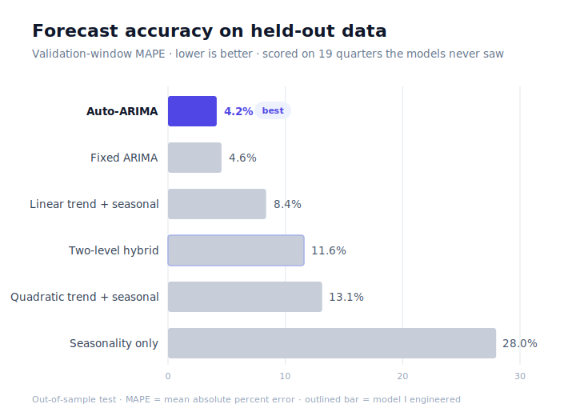

# walmart-revenue-forecasting

Forecasting a large retailer's quarterly revenue, and choosing the right method on evidence rather than by default.

## Problem
Quarterly revenue forecasts drive inventory, staffing, and budget decisions — so the method behind them matters. The question: how accurately can we project Walmart's revenue 1–2 years out, and which forecasting approach should a planning team actually trust?

## Data
Walmart public quarterly revenue, 2006 Q1 – 2025 Q3 (~79 quarters). The series has a strong upward trend and a hard Q4 holiday spike every year — the two patterns any model has to handle.

## Approach
Rather than fit one model and call it done, I built a **ladder of six methods** and scored each on a **held-out validation window of 19 quarters** — data no model saw during training, so the comparison reflects real forecasting skill, not memorization of history.

- Regression family — seasonality only, + linear trend, + quadratic trend
- ARIMA family — a fixed seasonal order and an auto-selected order
- A **two-level hybrid I engineered** — a quadratic regression with an AR(1) model layered on its residuals, motivated by leftover autocorrelation in the residual ACF (significant spikes at lag 1 and lag 4)

## Results
On the held-out window, **auto-ARIMA was the most accurate at ~4% MAPE — roughly half the error of the best regression model (~8%).**

The detail I'd flag in an interview: my two-level hybrid produced the **tightest in-sample fit of any model**, but placed mid-pack out-of-sample. That gap *is* the lesson — in-sample fit and forecasting accuracy are different things, and the residual diagnostics that motivated the hybrid are the real signal of what's going on under a clean-looking regression.

## What this shows
- Benchmarking discipline — choosing a model from a scored field, not a hunch
- Knowing the difference between in-sample fit and out-of-sample accuracy, and reporting the honest one
- Residual diagnostics (ACF) to detect structure a first-pass model misses
- Time-series modeling end to end in R: regression, ARIMA, and a custom two-level forecast

## Repo contents
| File | What it is |
|------|------------|
| `walmart_revenue_forecast.R` | Clean, reproducible analysis — data → model ladder → benchmark → chart → final forecast |
| `walmart_forecast_benchmark.svg` | The accuracy comparison above |
| `/archive` | Original full course write-ups, with every model summary and diagnostic |

*Tools: R (forecast, ggplot2). Methods: linear & quadratic trend regression, seasonal ARIMA, auto-ARIMA, two-level residual modeling.*
